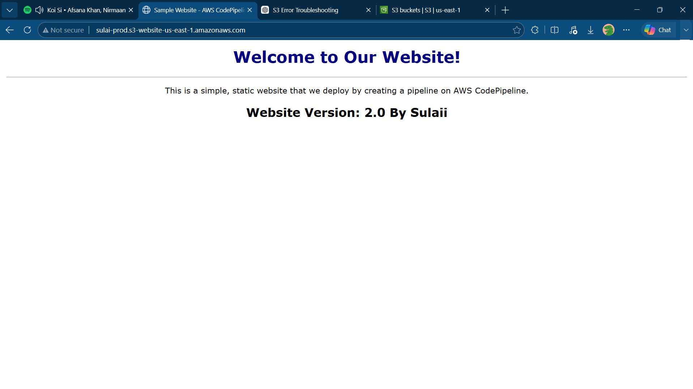
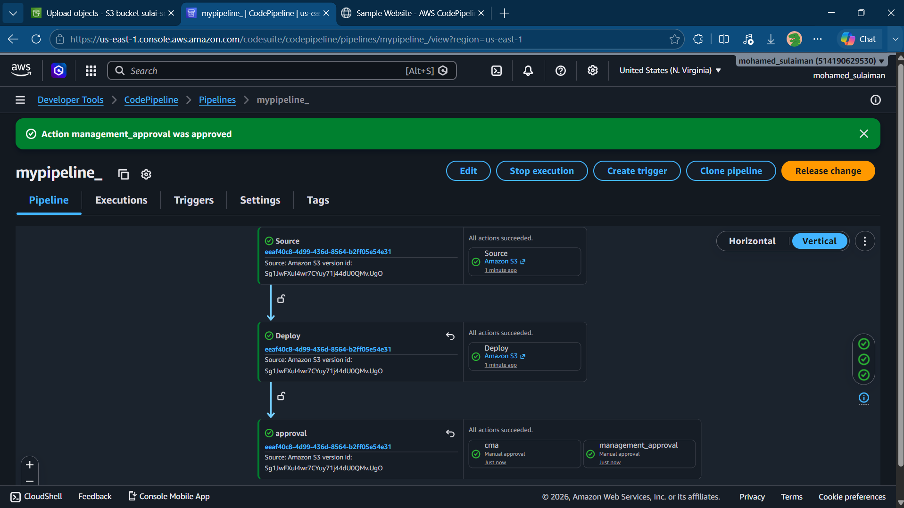
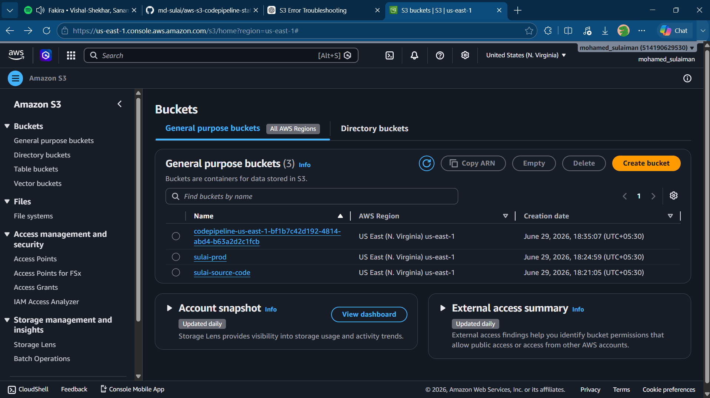

# AWS S3 Static Website Deployment using AWS CodePipeline

## 📌 Project Overview

This project demonstrates how to host a static website on Amazon S3 and automate deployments using AWS CodePipeline. The website is deployed automatically whenever updated files are uploaded to the source S3 bucket, providing a simple Continuous Integration and Continuous Deployment (CI/CD) workflow on AWS.

---

## 🚀 Technologies Used

- Amazon S3
- AWS CodePipeline
- AWS IAM
- HTML5
- CSS3

---

## 📂 Project Structure

```
aws-s3-codepipeline-static-website/
│
├── index.html
├── error.html
├── README.md
└── screenshots/
    ├── homepage.png
    ├── codepipeline.png
    └── s3bucket.png
```

---

## ⚙️ AWS Services

### Amazon S3
- Hosted the static website.
- Configured Static Website Hosting.
- Used `index.html` as the default page.
- Used `error.html` as the custom error page.

### AWS CodePipeline
- Automated deployment of website updates.
- Deployed files from the source S3 bucket to the production S3 bucket.

### AWS IAM
- Managed permissions required for CodePipeline to access Amazon S3.

---

## 🔄 Deployment Workflow

```
Developer
    │
    ▼
Upload Website Files
    │
    ▼
Amazon S3 (Source Bucket)
    │
    ▼
AWS CodePipeline
    │
    ▼
Amazon S3 (Production Bucket)
    │
    ▼
Static Website Endpoint
```

---

## ✨ Features

- Static website hosting using Amazon S3
- Automated deployment using AWS CodePipeline
- Custom index page
- Custom error page
- Version-based website updates
- Public website access

---

## 📖 Deployment Steps

1. Create an Amazon S3 source bucket.
2. Upload the website files.
3. Create a production S3 bucket.
4. Enable Static Website Hosting.
5. Configure:
   - Index Document: `index.html`
   - Error Document: `error.html`
6. Create an AWS CodePipeline.
7. Configure the source stage with Amazon S3.
8. Configure the deploy stage with the production S3 bucket.
9. Release the pipeline.
10. Access the website through the S3 Website Endpoint.

---

## 📸 Project Screenshots

### Homepage



### AWS CodePipeline



### Amazon S3 Bucket



---

## 🎯 Learning Outcomes

- Learned static website hosting using Amazon S3.
- Configured S3 bucket policies and public access.
- Built an automated deployment pipeline using AWS CodePipeline.
- Understood the basics of CI/CD on AWS.
- Gained hands-on experience with AWS cloud services.

---

## 🔮 Future Improvements

- Integrate GitHub as the source repository.
- Add AWS CodeBuild for automated builds.
- Deploy infrastructure using Terraform.
- Configure Amazon CloudFront for faster content delivery.
- Enable HTTPS using AWS Certificate Manager (ACM).

---

## ⭐ If you found this project useful, consider giving it a Star.

## Author
Mohamed Sulaiman

- GitHub: https://github.com/md-sulai
- LinkedIn: www.linkedin.com/in/mohasulai06
 
License
This project is created for learning and portfolio purposes.
